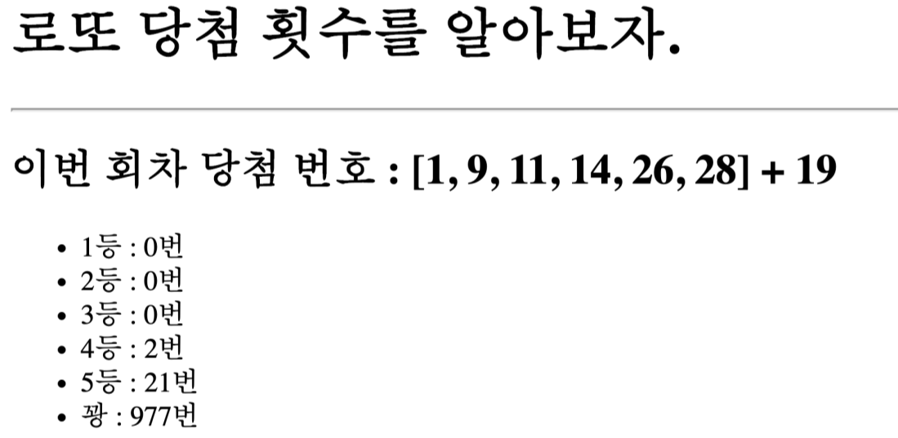

# Project- 로또 당첨 횟수

- 로또 api 사용([링크](https://www.dhlottery.co.kr/common.do?method=getLottoNumber&drwNo=1))




### 0. 가상환경 만들기

- 가상환경 생성

```bash
$ python -m venv venv 
```

- 가상환경 실행

```bash
$ source 경로(venv/scripts/python.exe)
```

vscode : `ctrl + shift + p` :python interpreter → enter interperter path에 경로 추가

→new terminal 실행

- requirment.tet

```bash
$ pip install -r requirment.txt
```

## 1. 프로젝트, 앱 만들기

### 프로젝트 : project 만들기

```bash
& django-admin startproject project
```

### 앱 : pages 만들기

- 앱을 만들 떄는 뒤에 복수형으로 만들기

```bash
& python manage.py startapp pages
```

- 앱을 만들고

- pages/settings.py 에 추가

```python
INSTALLED_APPS = [
		'django_extensions',
    'pages',  # 추가
    'django.contrib.admin',
    'django.contrib.auth',
    'django.contrib.contenttypes',
    'django.contrib.sessions',
    'django.contrib.messages',
    'django.contrib.staticfiles',
]
```

# 2. urls.py 설정

- project/urls.py

```python
from django.contrib import admin
from django.urls import path, include  # include 추가
from pages import views # 앱 경로 추가

urlpatterns = [
    path('admin/', admin.site.urls),
    path('pages/', include('pages.urls')), # pages/urls.py 경로 추가
]
```

- pages/urls.py

```python
from django.contrib import admin
from . import views 

app_nmae = 'pages'
urlpatterns = [
    path('lotto/', views.lotto, name="lotto")
]
```

## 3. base.html 설정

- templates/base.html

```python
<!DOCTYPE html>
<html lang="en">
<head>
  <meta charset="UTF-8">
  <meta http-equiv="X-UA-Compatible" content="IE=edge">
  <meta name="viewport" content="width=device-width, initial-scale=1.0">
  <link href="<https://cdn.jsdelivr.net/npm/bootstrap@5.1.0/dist/css/bootstrap.min.css>" rel="stylesheet" integrity="sha384-KyZXEAg3QhqLMpG8r+8fhAXLRk2vvoC2f3B09zVXn8CA5QIVfZOJ3BCsw2P0p/We" crossorigin="anonymous">
  <title>Document</title>
</head>
<body>
  <div class="container">
    
    
  </div>
  <script src="<https://cdn.jsdelivr.net/npm/bootstrap@5.1.0/dist/js/bootstrap.bundle.min.js>" integrity="sha384-U1DAWAznBHeqEIlVSCgzq+c9gqGAJn5c/t99JyeKa9xxaYpSvHU5awsuZVVFIhvj" crossorigin="anonymous"></script>
</body>
</html>
```

- 경로 practice/settings.py 에 추가

```python
TEMPLATES = [
    {
        'BACKEND': 'django.template.backends.django.DjangoTemplates',
        'DIRS': [BASE_DIR, 'templates'],  # 여기에 경로 추가
        'APP_DIRS': True,
        'OPTIONS': {
            'context_processors': [
                'django.template.context_processors.debug',
                'django.template.context_processors.request',
                'django.contrib.auth.context_processors.auth',
                'django.contrib.messages.context_processors.messages',
            ],
        },
    },
]
```

## 4. lotto.html 만들기

- 경로 : pages/templates/pages/lotto.html

```python
  # base.html에서 받아오기

  <h1>로또 당첨 횟수를 알아보자.</h1>
  <hr>
  <h2>이번 회차 당첨 번호 : {{ winno }} + {{ bonusNo }} </h2>
  <br>
  
  <ul>
    <li>{{ key }} : {{ item }}</li>
  </ul>
  

```

## 5. views.py 만들기

- 함수 lotto 만들기

```python
from django.shortcuts import render
import requests
import random

# Create your views here.
def lotto(request):
    url = "<https://www.dhlottery.co.kr/common.do?method=getLottoNumber&drwNo=1>"

    response = requests.get(url)
    lotto = response.json()
    winno = []
    for i in range(1, 7):
        winno.append(lotto[f'drwtNo{i}'])

    cnt = {'1등':0, '2등':0, '3등':0, '4등':0, '5등':0, '꽝':0}
    for i in range(1000):
        my_number = random.sample(range(1, 46), 6)
        count = 0
        for j in my_number:
            if j in winno:
                count += 1
        if count == 6:
            cnt['1등'] += 1
        elif count == 5 and lotto['bnusNo'] in my_number:
            cnt['2등'] += 1
        elif count == 5:
            cnt['3등'] += 1
        elif count == 4:
            cnt['4등'] += 1
        elif count == 3:
            cnt['5등'] += 1
        else:
            cnt['꽝'] += 1

    context = {
        'lotto': lotto,
        'winno': winno,
        'bonusNo': lotto['bnusNo'],
        'win_rate': cnt,
    }
    return render(request, 'pages/lotto.html', context)
```

## 6. 실행해보기

- 경로 : http://127.0.0.1:8000/pages/lotto/

```bash
$ python manage.py runserver
```