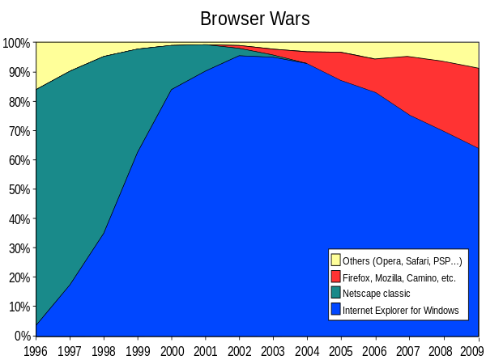
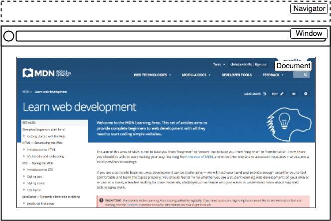

# 01. JavaScript Basic

## 브라우저 (Browser)

- 웹 서버에서 이동하며 클라이언트와 서버 간 양방향으로 통신하고, HTML 문서나 파일을 출력하는 GUL 기반의 소프트웨어
- 인터넷의 컨텐츠를 검색 및 열람하도록 함
- "웹 브라우저"

## JavaScript의 필요성

- 브라우저 **화면을 '동적(Dynamic)'**으로 만들기 위함
- 브라우저를 **조작할 수 있는 유일한 언어**
- 2021에서 가장 많이 쓰이는 언어
- [stackoverflow 2021 survey](https://insights.stackoverflow.com/survey/2021#most-popular-technologies-language)

------

# 2. History of JavaScript

## 2-1. 핵심 인물

### Tim Berners-Lee(팀 버너스리)

- www, URL, HTTP, HTML 최초 설계자
- 웹의 아버지

### Brendan Eich(브랜던 아이크)

- JS 최초 설계자
- 모질라 재단 공동 설립자, 파이어폭스의 전신

## 2-2. JavaScript의 탄생

- 1994년 당신 Netscape Navigator(NN) 브라우저가 전 세계 점유율을 80% 이상 독점하며 브라우저의 표준 역할을 함
- 당시 넷스케이프에 재직 중이던 브랜던 아이크가 HTML을 동적으로 동작하기 위한 회사 내부 프로젝트를 진행 중 JS를 개발
- JavaScript 이름 변천사
  - Mocha → LiveScript → JavaScript(1995)
  - 90년도 당시 가장 인기 있던 언어 Java의 인기에 편승하기 위해 이름을 가져옴
  - Java언어랑 전혀 관련 없음
- 1995년 경쟁사 MS에서 이를 채택하여 커스터마이징한 JScript를 만듦
- 이를, IE 1.0에 탑재 ⇒ 1차 브라우저 전쟁의 시작

### 2-3. 제 1차 브라우저 전쟁(1996 ~ 2008)

- [wikiwand](https://www.wikiwand.com/en/Browser_wars)
- 넷스케이프 vs 마이크로소프트 (이하 MS)
- 빌 게이츠 주도하에 MS는 1997년 IE 4를 발표하면서 시장을 장악하기 시작
  - 당시 윈도우 OS의 시장 점유율은 90%
  - 글로벌 기업 MS의 공격적인 마케팅
- MS의 승리로 끝나며 2001년부터 IE의 점유율은 90%을 상회
- 1998년 넷스케이프에서 나온 브랜던 아이크 외 후계자들은 모질라 재단을 설립
  - 파이어폭스를 통해 IE에 대항하며 꾸준히 점유율을 올려 나감

### 2-4. 제 2차 브라우저 전쟁(2009~ )

- MS vs Google
- 2008년 Google의 Chrome(이하 크롬) 브라우저 발표
- 2011년 3년 만에 파이어폭스의 점유율을 돌파 후 2012년 전 세계 점유율 1위 탈환
- 크롬의 승리 요인
  - **압도적인 속도**
  - 강력한 개발자 도구 제공
  - 웹 표준, 웹 표준을 가장 잘 지키고 이행

### 2-5. 파편화와 표준화

- 제 1차 브라우저 전쟁 이후 수많은 브라우저에서 자체 자바스크립트 언어를 사용하게 됨
- 결국 서로 다른 자바스크립트가 만들어지면서 크로스 브라우징 이슈가 발생하여 웹 표준의 필요성이 제기
- 크로스 브라우징(Cross browsing)
  - W3C에서 채택된 표준 웹 기술을 채용하여 각각의 브라우저마다 다르게 구현되는 기술을 비슷하게 만들되, 어느 한쪽에 치우치지 않도록 웹 페이지를 제작하는 방법론
  - 동일성이 아닌 **동등성**
  - 브라우저마다 렌더링에 사용하는 엔진이 다르기 때문
- 1996년부터 넷스케이프는 표준 제정의 필요성을 주장
  - ECMA 인터내셔녈(정보와 통신 시스템을 위한 국제적 표준화 기구)에 표준 제정 요청
- 1997년 ECMAScript 1 (ES1) 탄생
- 제 1차 브라우저 전쟁 이후 제기된 언어의 파편화를 해결하기 위해 각 브라우저 회사와 재단은 표준화에 더욱 적극적으로 힘을 모으기 시작

### 2-6. JavaScript ES6+

- 2015년 ES2015 (ES6) 탄생
  - "Next-gen of JS"
  - JS의 고질적인 문제들을 해결
  - JS의 다음 시대라고 불릴 정도로 많은 혁신과 변화를 맞이한 버전
  - 이때부터 버전 순서가 아닌 출시 연도를 붙이는 것이 공식 명칭이나 통상적으로 ES6라 부름
  - 현재는 표준 대부분이 ES6+로 넘어옴

### 2-7. Vanilla JavaScript

- 크로스 브라우징, 간편한 활용 등을 위해 많은 라이브러리 등장(jQuery 등)
  - 라이브러리는 점점 필요가 없어지는 추세
- ES6 이후, 다양한 도구의 등장으로 **순수 자바스크립트(Vanilla JavaScript) 활용**의 증대

------

# 3. DOM(Document Object Model)

- DOM 조작
  - 문서(HTML) 조작
- BOM 조작
  - navigator, screen, location, frames, history, XHR
- JavaScript Core (ECMAScript) : 프로그래밍 언어
  - 자료구조, 조건, 반복

## DOM이란?

- HTML, XML과 같은 문서를 다루기 위한 

  문서 프로그래밍 interface,

   트리자료구조

  - DOM형태가 오면 HTML을 LAYOUT로 해석하는 인터페이스(상호작용)

- 문서를 구조화하고 **구조화된 구성 요소를 하나의 객체로 취급**하여 다루는 논리적 트리 모델

- 문서가 구조화되어 있으며 각 요소는 객체(object)로 취급

- 단순한 속성 접근, 메서드 활용뿐만 아니라 프로그래밍 언어적 특성을 활용한 조작 가능

- 주요 객체

  - `window` : DOM을 표현하는 창. 가장 최상위 객체(생략가능)
  - `document` : 페이지 컨텐츠의 Entry Point 역할을 하며, <body> 등과 같은 수많은 다른 요소들을 포함
  - navigator, location, history, screen

## DOM 해석

- 파싱 (parsing)
  - 구문 분석, 해석
  - 브라우저가 문자열을 해석하며 DOM Tree로 만드는 과정

## BOM 이란?

- Browser Object Model
- JS가 브라우저와 소통하기 위한 Model
- 브라우저의 창이나 프레임을 추상화해서 프로그래밍적으로 제어할 수 있도록 제공하는 수단
  - 버튼, URL 입력창, 타이틀 바 등 브라우저 윈도우 및 웹 페이지 일부분을 제어 가능
- window 객체는 모든 브라우저로부터 지원받으며 브라우저의 창(window)를 지칭

## DOM 조작

### 개념

- Document는 문서 한 장(HTML)에 해당하고 이를 조작
- DOM 조작 순서
  1. 선택(Select)
  2. 변경(Manipulation)

### DOM 관련 객체의 상속 구조

- EventTarget
  - Event Listener를 가질 수 있는 객체가 구현하는 DOM 인터페이스
- Node
  - 여러 가지 DOM 타입들이 상속하는 인터페이스
- Element
  - Document 안의 모든 객체가 상속하는 가장 범용적인 기반 클래스
  - 부모인 Node와 그 부모인 EventTarget의 속성을 상속
- Document
  - 브라우저가 불러온 웹 페이지를 나타냄
  - DOM 트리의 진입점(entry point) 역할을 수행
- HTMLElement
  - 모든 종류의 HTML 요소
  - 부모 element의 속성 상속

## DOM 선택

### 선택 관련 메서드

- Document**.querySelector(selector)**
  - 제공한 선택자와 일치하는 element 하나 선택
  - 제공한 CSS selector를 만족하는 첫 번째 element 객체 반환 (없다면 null)
- Document**.querySelectorAll(selector)**
  - 제공한 선택자와 일치하는 여러 element를 선택
  - 매칭 할 하나 이상의 셀렉터를 포함하는 유효한 CSS selector를 인자(문자열)로 받음
  - 지정된 셀렉터에 일치하는 NodeList를 반환
- getElementById(id), getElementByname(name), getElementByClassName(names)
- **querySelector(), querySelectorAll()을 사용하는 이유**
  - id, class 그리고 tag 선택자 등을 모두 사용 가능하므로, 더 구체적이고 유연하게 선택 가능

### 선택 메서드별 반환 타입

1. 단일 element
   - getElementById(id)
   - **querySelector()**
2. HTMLCollection
   - getElementByname(name), getElementByClassName(names)
3. NodeList
   - **querySelectorAll()**

### HTMLCollection & NodeList

- 둘 다 배열과 같이 각 항목에 접근하기 위한 index를 제공 ( 유사 배열)
- HTMLCollection
  - name, id, index 속성으로 각 항목에 접근 가능
- NodeList
  - index로만 각 항목에 접근 가능
  - 단, HTMLCollection과 달리 배열에서 사용하는 forEach함수 및 다양한 메서드 사용 가능
- 둘 다 Live Collection으로 DOM의 변경사항을 실시간으로 반영하지만, querySelectorAll()d에 의해 반환되는 NodeList는 Static Collection으로 실시간으로 반영되지 않음

### Collection

- LiveCollection
  - 문서가 바뀔 때 실시간으로 업데이트됨
  - DOM의 변경사항을 실시간으로 collection에 반영
  - ex) HTMLCollection, NodeList
- StaticCollection (non-live)
  - DOM이 변경되어도 collection 내용에는 영향을 주지 않음
  - querySelectorAll()의 반환 NodeList만 static collection

## DOM 변경

### Creation

- Document.createElement()
  - 작성한 태그 명의 HTML 요소를 생성하여 반환
- Element.append()
  - 특정 부모 Node의 자식 NodeList중 마지막 자식 다음에 Node 객체나 DOMString을 삽입
  - 여러 개의 Node 객체, DOMString을 추가할 수 있음
  - 반환 값 X
- Node.appendChild()
  - 한 Node를 특정 부모 Node의 자식 NodeList 중 마지막 자식으로 삽입
  - Node만 추가 가능
  - 한번에 오직 하나의 Node만 추가 가능
  - 만약 주어진 Node가 이미 문서에 존재하는 다른 Node를 참조한다면 새로운 위치로 이동

### Property

- Node.innerText
  - Node 객체와 그 자손의 텍스트 컨텐츠(DOMString)를 표현
  - 즉, 줄 바꿈을 인식하고 숨겨진 내용을 무시하는 등 최종적으로 스타일링이 적용된 모습으로 표현
- Element.innerHTML
  - 요소(element) 내에 포함된 HTML 마크업을 반환
  - [참고] XSS공격에 취약하므로 사용 시 주의

> XSS (Cross-site Scripting)

- 공격자가 웹 사이트 클라이언트 측 코드에 악성 스크립트를 삽입해 공격하는 방법
- 피해자의 브라우저가 악성 스크립트를 실행하며 공격자가 엑세스 제어를 우회하고 사용자를 가장 할 수 있도록 함 (CSRF 공격과 유사)

### Remove

- ChildNode.remove()
  - Node가 속한 트리에서 해당 Node를 제거
- Node.removeChild()
  - DOM에서 자식 Node를 제거하고 제거된 Node를 반환
  - Node는 인자로 들어가는 자식 Node의 부모 Node (부모.removeChild(자식))

## DOM 속성

- Element.setAttribute(name, value)
  - 지정된 요소의 값을 설정
  - 속성이 이미 존재하면 값을 갱신, 존재하지 않으면 지정된 이름과 값으로 새 속성을 추가
- Element.getAttribute(attributeName)
  - 해당 요소의 지정된 값(문자열)을 반환
  - 인자는 값을 얻고자 하는 속성의 이름

------

# 4. Event

> "특정 이벤트가 발생**하면**, 할 일을 등록**한다**." ~ 하면, ~ 한다. 예) 클릭**하면**, 경고창**을 띄운다**.

## Event 개념

- 네트워크 활동이나 사용자와의 상호작용 같은 사건의 발생을 알리기 위한 객체
- 이벤트 발생
  - 마우스를 클릭하거나 키보드를 누르는 등 사용자 행동으로 발생할 수도 있음
  - 특정 메서드를 호출(Element.click())하여 프로그래밍적으로도 만들어 낼 수 있음

## Event Interface

- AnimationEvent, ClipboardEvent, DragEvent 등
- UIEvent
  - 간단한 사용자 인터페이스 이벤트
  - Event의 상속을 받음
  - MouseEvent, keyboardEvent, InputEvent, FocusEvent 등의 부모 객체 역할을 함

## Event handler

- [MDN](https://developer.mozilla.org/ko/docs/Web/API/Event)

### addEventListener()

- 지정한 이벤트가 대상에 전달될 때마다 호출할 함수를 설정
- 이벤트를 지원하는 모든 객체를 대상으로 지정 가능
- EventTarget.addEventListener(type, listner[, options])

> "**대상**에 **특정 이벤트**가 발생하면, **할 일을** 등록하자"

- EventTarget : 대상
- type : 특정 이벤트
  - 반응 할 이벤트 유형 (대소문자 구분 문자열)
- listener : 할 일
  - 지정된 타입의 이벤트가 발생했을 때 알림을 받는 객체
  - EventListener 인터페이스 혹은 JS function 객체(콜백 함수)여야 함

## Event 취소

- Event.preventDefault()
- 현재 이벤트의 기본 동작을 중단
- 태그의 기본 동작을 작동하지 않게 막음
- 이벤트를 취소할 수 있는 경우, 이벤트의 전파를 막지 않고 그 이벤트를 취소
- 취소 할 수 없는 이벤트도 존재
  - 이벤트의 취소 가능 여부는 event.cancelable을 사용해 확인 가능