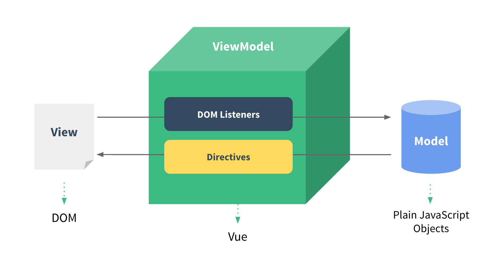
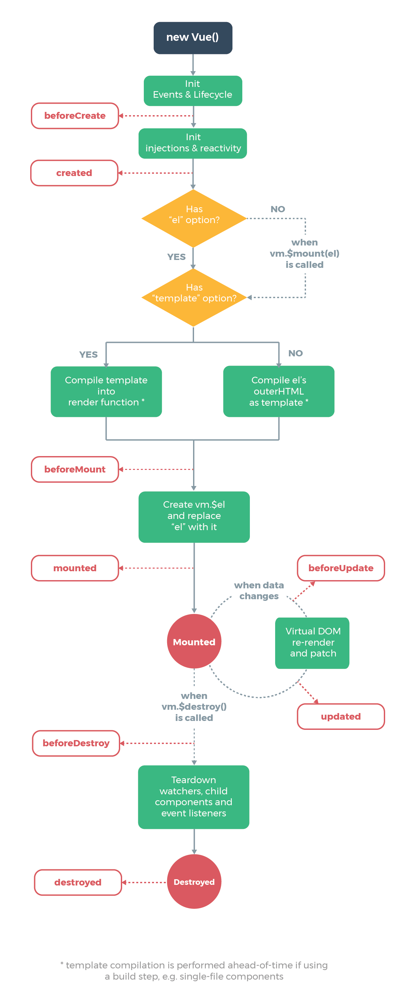

# 01. Vue.js : Basic

# 1. Intro

## 1-1. Front-End Development

- HTML, CSS 그리고 JS를 활용해서 데이터를 볼 수 있게 만들어 줌

  - 이 작업을 통해 사용자는 데이터를 눈으로 볼 수 있고, 데이터와 상호작용 할 수 있음

- 대표적인 Front-End Framework

  - Vue.js, React, Angular

  

## 1-2. Vue.js

- UI 를 만들기 위한 진보적인 **자바스크립트 프레임워크**
- 현대적인 tool과 다양한 라이브러리를 통해 **SPA(Single Page Application)를 완벽하게 지원**

> [참고] Evan You에 의해 발표(2014)

- 구글의 Angular 개발자 출신
- 학사 미술, 미술사 전공/ 석사 디자인 & 테크놀로지 전공
- 구글 Angular보다 더 가볍고, 간편하게 사용할 수 있는 프레임워크를 만들기 위해 개발


## 1-3. SPA (Single Page Application)

- 현재 페이지를 동적으로 렌더링함으로써 사용자와 소통하는 웹 애플리케이션
- 단일 페이지로 구성되며 서버로부터 최초에만 페이지를 다운로드하고, 이후에는 동적으로 DOM을 구성
  - 처음 페이지를 받은 이후부터는 서버로부터 새로운 전체 페이지를 불러오는 것이 아닌, 현재 페이지 중 필요한 부분만 동적으로 다시 작성함
- 연속되는 페이지 간의 UX 향상
  - 모바일 사용량이 증가하고 있는 현재 트래픽의 감소와 속도, 사용성, 반응성의 향상은 매우 중요하기 때문
- 동작 원리의 일부가 CSR(Client Side Rendering)의 구조를 따름


### SPA 등장 배경

- 과거 웹 사이트들은 요청에 따라 매번 새로운 페이지를 응답하는 방식
  - MPA (Multi Page Application)
- 스마트폰이 등장하면서 모바일 최적화의 필요성이 대두됨
  - 모바일 네이티브 앱과 같은 형태의 웹 페이지가 필요해짐
- 이러한 문제를 해결하기 위해 Vue.js와 같은 Front-End 프레임워크가 등장
  - CSR, SPA의 등장
- 1개의 웹 페이지에서 여러 동작이 이루어지며 모바일 앱과 비슷한 형태의 사용자 경험을 제공


## 1-4. CSR (Client Side Rendering)

- 서버에서 화면을 구성하는 SSR 방식과 달리 클라이언트에서 화면을 구성
- 최초 요청 시 HTML, CSS, JS 등 데이터를 제외한 각종 리소스를 응답받고 이후 클라이언트에서는 필요한 데이터만 요청해 JS로 DOM을 렌더링하는 방식
- 즉, 처음엔 뼈대만 받고 브라우저에서 동적으로 DOM을 그림
- **SPA가 사용하는 렌더링 방식**
- [The Benefits of Server Side Rendering Over Client Side Rendering](https://medium.com/walmartglobaltech/the-benefits-of-server-side-rendering-over-client-side-rendering-5d07ff2cefe8)

### 장점

1. 서버와 클라이언트 간 트래픽 감소
   - 웹 앱에 필요한 모든 정적 리소스를 최초에 한 번 다운로드 후 필요한 데이터만 갱신
2. UX 향상
   - 전체 페이지를 다시 렌더링하지 않고 변경되는 부분만을 갱신하기 때문

### 단점

1. SSR에 비해 전체 페이지 렌더링 시점이 느림
2. SEO(검색 엔진 최적화)에 어려움이 있음 ( 최초 문서에 데이터가 없기 때문)


## 1-5. SSR (Server Side Rendering)

- 서버에서 클라이언트에게 보여줄 페이지를 모두 구성하여 전달하는 방식
- JS 웹 프레임워크 이전에 사용되던 전통적인 렌더링 방식

### 장점

1. 초기 구동 속도가 빠름
2. SEO에 적합
   - DOM에 이미 모든 데이터가 작성되어 있기 때문

### 단점

- 모든 요청마다 새로운 페이지를 구성하여 전달

  - 반복되는 전체 새로고침으로 인해 사용자 경험이 떨어짐
  - 상대적으로 트래픽이 많아 서버의 부담이 클 수 있음

  

## 1-6. SSR & CSR

- 두 방식의 차이는 렌더링의 주최가 누구인가에 따라 결정
  - 서버 vs 클라이언트
- 예를 들어, Django에서 Axios를 활용한 좋아요/팔로우 로직의 경우, 대부분은 Server에서 완성된 HTML을 제공하는 구조(SSR)
- 단, 특정 요소(좋아요/팔로우)만 JS(AJAX & DOM조작)를 활용 (CSR)
  - AJAX를 활용해 비동기 요청으로 필요한 데이터를 클라이언트에서 서버로 직접 요청을 보내 받아오고 JS를 활용해 DOM을 조작

> [참고] SEO (Search Engine Optimization)

- 자료를 수집하고 순위를 매기는 방식에 맞게 웹 페이지를 구성해서 검색 결과의 상위에 노출될 수 있도록 하는 작업
- 인터넷 마케팅 방법 중 하나
- 구글의 등장 이후 검색엔진들이 컨텐츠의 신뢰도를 파악하는 기초 지표로 사용됨
  - 다른 웹 사이트에서 얼마나 인용되었나를 반영
  - 결국 타 사이트에 인용되는 횟수를 늘리는 방향으로 최적화
  - [검색엔진 최적화(SEO) 기본 가이드](https://developers.google.com/search/docs/beginner/seo-starter-guide)

> [참고] SEO 대응

- Vue.js 또는 React 등의 SPA 프레임워크는 SSR을 지원하는 SEO 대응 기술이 이미 존재
  - SEO 대응이 필요한 페이지에 대해서는 선별적 SEO 대응 가능
- 혹은 추가로 별도의 프레임워크를 사용하기도 함
  - Nuxt.js
    - Vue.js 응용 프로그램을 만들기 위한 프레임워크
    - SSR 지원
  - Next.js
    - React 응용 프로그램을 만들기 위한 프레임워크

---


# 2. Why Vue.js?

### 왜 사용할까?

- 현대 웹 페이지는 페이지 규모가 계속해서 커지고 있으며, 그만큼 사용하는 데이터도 늘어나고 사용자와의 상호작용도 많이 이루어짐
- 결국 Vanilla JS 만으로는 관리하기가 어려움
  - 예시) "페이스북 친구가 이름을 수정했을 경우, 화면상에서 변경되어야 하는 것들"
  - 타임라인의 이름, 페이스북 메시지 상으 ㅣ이름, 내 주소록에서의 친구 이름 등
  - → 페이스북이 React를 개발한 이유

### 비교

- Vanilla JS
  - 한 유저가 100만 개의 게시글 작성
  - 이 유저가 닉네임을 변경하면, 게시글 100만 개의 작성자 이름이 모두 수정되어야 함
  - '모든 요소'를 선택해서 '이벤트'를 등록하고 값을 변경해야 함(코드 중복)
- Vue.js
  - DOM과 Data가 연결되어 있으면
  - Data를 변경하면 이에 연결된 DOM은 알아서 변경
  - 즉, 우리가 신경써야 할 것은 오직 **Data에 대한 관리**

---


# 3. Concepts of Vue.js

## MVVM Pattern

- 애플리케이션 로직을 UI로부터 분리하기 위해 설계된 디자인 패턴



### Model

- "Vue에서 Model은 JS Object다."
- JS의 Object 자료 구조 { key: value }
- 이 Object는 Vue Instance 내부에서 data로 사용되는데, 이 값이 바뀌면 View(DOM)가 반응

### View

- "Vue에서 View는 DOM(HTML)이다."
- Data의 변화에 따라서 바뀌는 대상

### ViewModel

- "Vue에서 ViewModel은 모든 Vue Instance이다."
  - 파이썬의 클래스 인스턴스 생성하는 것처럼
- View와 Model 사이에서 Data와 DOM에 관련된 모든 일을 처리
- ViewModel을 활용해 Data를 얼마만큼 잘 처리해서 보여줄 것인지(DOM에서)를 고민하는 것
- controller 와 비슷한 역할

---


# 4. Quick Start of Vue.js

- Django

  - "데이터의 흐름"
  - url → views → template

- Vue.js

  - "Data가 변화하면 DOM이 변경"

  1. Data 로직 작성
  2. DOM 작성

- **[doc tutorial](https://kr.vuejs.org/v2/guide/)**

- ViewModel : app 부분

- Model : data, method 부분

- View : 위쪽의 HTML(DOM) 부분

```python
const app = new Vue({
      el: '#app',
      data: {
        message: '안녕하세요 Vue!'
      }
    })
```

# Template Syntax

- 메서드 정의할때는 화살표 함수 사용 X

## v-bind

- HTML 요소의 속성에 Vue의 상태 데이터를 값으로 할당
- Object 형태로 사용하면 value가 True인 key가 class 바인딩 값으로 할당
- 약어(shorthand)
  - : (콜론)
  - v-bond:href → : href
  - :key 도 v-bind 생략 된 거임

# Lifecycle Hooks

- 각 Vue 인스턴스는 생성될 때 일련의 초기화 단계를 거침
  - 예를 들어 데이터 관찰 설정이 필요한 경우,
  - 인스턴스를 DOM에 마운트하는 경우,
  - 데이터가 변경되어 DOM를 업데이트하는 경우 등
- 그 과정에서 사용자 정의 로직을 실행할 수 있는 Lifecycle Hooks도 호출됨
- 공식문서를 통해 각 라이프사이클 훅의 상세 동작을 참고([링크](https://vuejs.org/v2/guide/instance.html#Lifecycle-Diagram))



# Lodash Library

- 모듈성, 성능 및 추가 기능을 제공하는 JavaScript 유틸리티 라이브러리
- array, object 등 자료구조를 다룰 때 사용하는 유용하고 간편한 유틸리티 함수들을 제공
- 함수 예시
  - reverse, sortBy, range, random ...
