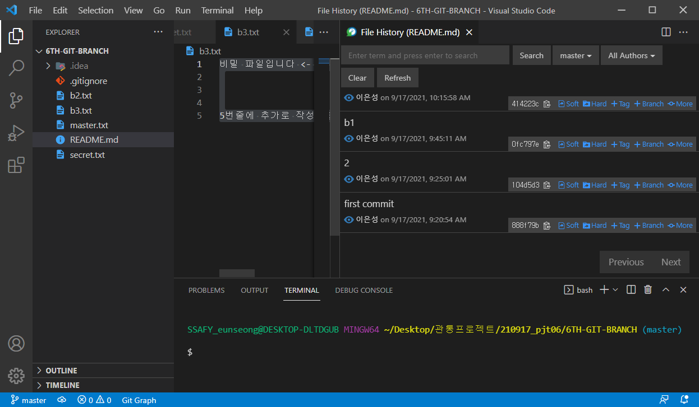
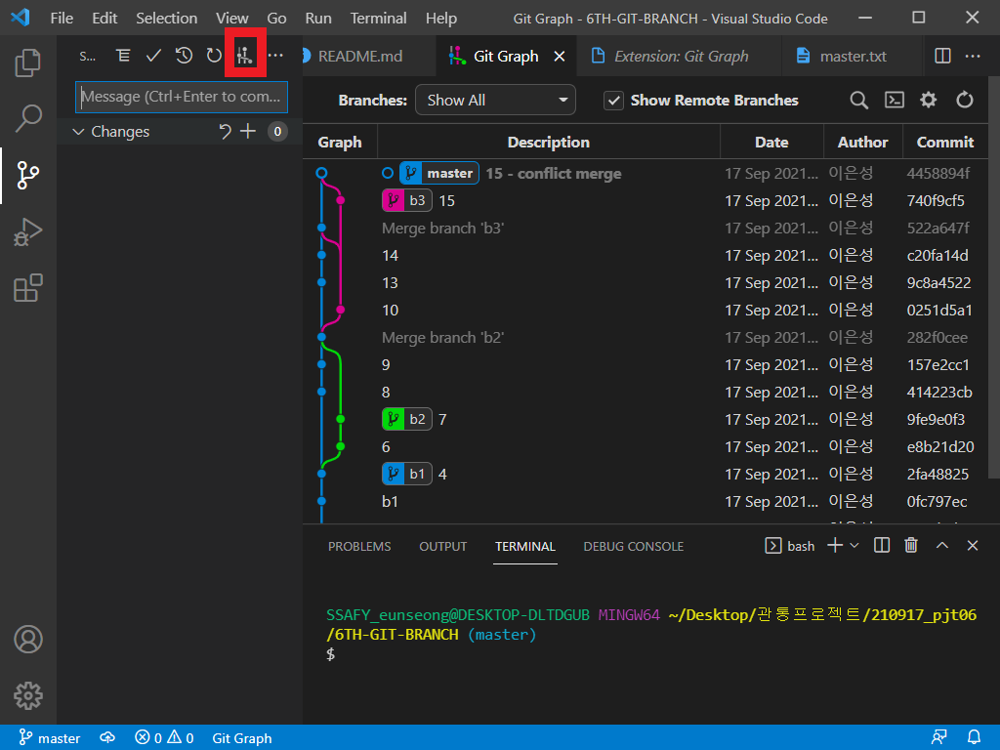

### 참고 링크

누구나 쉽게 이해할 수 있는 Git 입문([링크](https://backlog.com/git-tutorial/kr/stepup/stepup1_1.html))

생활코딩([링크](https://opentutorials.org/course/3840))

### vscode

- git history

  

- git graph

  

------

## git branch

```
$ git branch
```

- branch 확인

```
$ git branch <name>
```

- 내가작업하고 있는 시점에서 새로운 branch 생성

```bash
$ git log --oneline
104d5d3 (HEAD -> master, b1) 2
888f79b first commit
$ git switch 이름
```

- head가 이동

```bash
$ git log --oneline 
104d5d3 (HEAD -> b1, master) 2
888f79b first commit
$ git log --oneline
```

- 자기가 걸어온 길(commit) 했던 과거만 보여줌

```
$ git switch -c b3
```

- 새로운 branch b3를 생성하면서 바꾸기

## 병합

### 1) fast-forward : `git merge b1`

- branch `b1` 이 걸어온 길 흡수

```bash
$ git merge b1
Updating 104d5d3..2fa4882
Fast-forward
 README.md  | 3 ++-
 secret.txt | 0
 2 files changed, 2 insertions(+), 1 deletion(-)
 create mode 100644 secret.txt
```

### 2) Auto Merge

- **commit을 동반**
- 각각 다른 길을 걸은 두 branch를 병합
- b2는 7에 master는 9 에 있었다.

```bash
SSAFY_eunseong@DESKTOP-DLTDGUB MINGW64 ~ (master)
$ git merge b2

$ git log --oneline 
282f0ce (HEAD -> master) Merge branch 'b2'
157e2cc 9
414223c 8
9fe9e0f (b2) 7
e8b21d2 6
2fa4882 (b1) 4
0fc797e b1
```

- 지금까지 현황 :graph로 보기
- q를 누르면 나올 수 있다

```bash
$ git log --oneline --graph
*   282f0ce (HEAD -> master) Merge branch 'b2'
|\\  
| * 9fe9e0f (b2) 7
| * e8b21d2 6
* | 157e2cc 9
* | 414223c 8
|/
:
```

### 3) CONFLICT(Manual) Merge

- 파일은 직접 수정가능

```bash
$ git merge b3
Auto-merging secret.txt
CONFLICT (content): Merge conflict in secret.txt
Automatic merge failed; fix conflicts and then commit the result.

SSAFY_eunseong@DESKTOP-DLTDGUB MINGW64 ~ (master|MERGING)
```

## Summary

- 'b1' 과 'master' 는 별개의 공간이다.
- `commit` 을 해야 작업의 변동사항(버전이)이 기록된다.
- commit을 하지 않는 작업은 git이 관리하지 않는다.
- 각각의 head는 그 전까지의 commit만 추적한다.